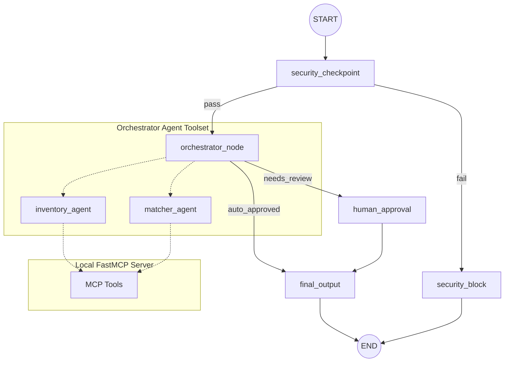

# Google x Kaggle Hackathon Submission Write-up
## Project Name: Food Share 🌍

---

## 1. Problem Statement
Every year, grocery stores and restaurants discard tons of edible food due to minor imperfections, overstocking, or near-term expiry. At the same time, local shelters struggle to source food to feed vulnerable populations. Connecting these two entities manually is highly inefficient due to matching delays, varying shelter requirements, and complex logistics. Furthermore, safety regulations prohibit distributing expired or hazardous goods, meaning donations must be rigorously vetted before being delivered.

**Food Share** addresses this gap by automating the extraction, verification, and matching of food surplus donations to local shelters based on real-time needs, expiry constraints, and safety guidelines.

---

## 2. Solution Architecture
Below is the architectural layout showing how requests flow through the multi-agent system, security guardrails, and mock database toolsets.

---

## 3. Key Concepts Used

### ADK Workflow (Graph)
- **Implementation**: Written in [agent.py](app/agent.py#L224-L235) using ADK 2.0 `Workflow` and `Edge` models.
- **Why it matters**: Models the operational workflow as a state machine where execution branches dynamically based on security status and manual approval requirements.

### LlmAgent
- **Implementation**: Defined in [agent.py](app/agent.py#L66-L106) (`inventory_agent`, `matcher_agent`, and `orchestrator_agent`).
- **Why it matters**: Leverages LLMs for semantic understanding: parsing unstructured donor messages into structured schemas (`DonationInventory` and `MatchPlan`) and determining semantic matching rationale.

### AgentTool
- **Implementation**: Referenced in `orchestrator_agent` [agent.py](app/agent.py#L104) to expose the specialized agents to the orchestrator.
- **Why it matters**: Enables modular hierarchy, letting the orchestrator coordinate and gather inputs from sub-specialists dynamically.

### MCP Server
- **Implementation**: Created in [mcp_server.py](app/mcp_server.py) using the FastMCP SDK.
- **Why it matters**: Bridges the LLMs to the application state (e.g. retrieving available shelters, checking existing logs, and writing matching results to database registries).

### Security Checkpoint
- **Implementation**: Implemented as the first node in [agent.py](app/agent.py#L113-L164).
- **Why it matters**: Implements zero-trust guardrails before LLM execution, shielding the agents from malicious injections and enforcing domain boundaries (e.g. banning alcohol and scrubbing PII).

---

## 4. Security Design
The system implements a multi-layer guardrail system:
1. **Prompt Injection Blocker**: Scans inputs for common override phrases (e.g. "ignore previous instructions") and reroutes to the terminal `security_block` node immediately to prevent LLM manipulation.
2. **Domain-Specific Rules**: Restricts input content to safe, edible food donations. Specifically blocks illicit substances, drugs, and alcohol (e.g. "whiskey", "beer").
3. **PII Scrubbing**: Regex filters automatically scan and redact phone numbers and email addresses to protect donor privacy before passing data to the LLM.
4. **Structured JSON Audit Logs**: Emits standardized logs containing details of the safety checkpoint execution (severity levels `INFO`, `WARNING`, `CRITICAL`), helping monitoring services flag violations immediately.

---

## 5. MCP Server Design
The FastMCP server exposes three specific domain tools:
- `get_active_shelters()`: Exposes a registry of local shelters, their locations, accepted food categories (e.g. dairy, dry goods), and urgent needs.
- `get_current_inventory()`: Fetches the database of already logged and matched donations to maintain real-time auditability.
- `log_matched_donation(donor, shelter, item, quantity, unit)`: A write-operation tool that writes matched donations to the database, ensuring matches are locked in.

---

## 6. Human-in-the-Loop (HITL) Flow
To ensure food safety regulations, any donation containing items expiring within **48 hours** requires manual review. 
- The `orchestrator_node` uses a deterministic datetime validation script on the donor message.
- If near-expiry items are detected, the node overrides the routing and redirects the workflow to `human_approval`.
- The `human_approval` node uses the ADK `RequestInput` class to pause execution and prompt the coordinator:
  `✋ MATCH REQUIRES REVIEW: Contains items expiring within 48h... Do you approve this match? (yes/no)`
- The workflow resumes execution only when the operator types their response.

---

## 7. Demo Walkthrough
1. **Case 1 (Auto-Approved)**: Whole Foods donates 50 kg of rice expiring in December. Vetted by security checkpoint, parsed by inventory specialist, matched to Community Food Pantry (which has an urgent need for rice). The expiry is far out, so it is auto-approved andlogged.
2. **Case 2 (Needs Review)**: Trader Joe's donates 10 boxes of fresh milk expiring tomorrow. Vetted by security checkpoint, matched to Hope Shelter (which needs milk/dairy). Because it expires within 48h, the system interrupts the execution, prompts the user in the UI, and completes upon receiving a "yes" approval.
3. **Case 3 (Rejected)**: A donor tries to donate 5 bottles of whiskey. The security checkpoint catches the forbidden keyword "whiskey", logs a warning severity audit log to the terminal, and routes the flow to the Access Denied terminal node.

---

## 8. Impact / Value Statement
Food Share bridges the gap between surplus providers and food banks. By automating safety vetting and semantic matching:
- **Shelters** receive precisely what they need, reducing waste at the shelter level.
- **Donors** get an instant, friction-free way to find homes for their surplus.
- **Logistics coordinators** gain automated safety guarantees, ensuring no unsafe or expired food gets distributed, reducing liability.
